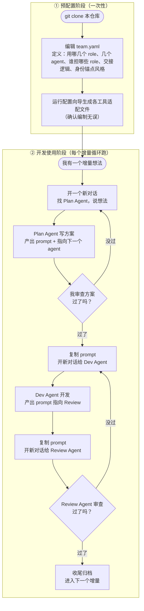

# 多 Agent 协作开发框架

> 把"一个人编排、多个 AI agent 接力开发"的流程，做成任何项目都能 clone 即用的脚手架。
> 核心理念：**人当低频编排器，agent 各司其职，所有交接走文件，每个节点可审查、可回滚。**

---

## 这套东西解决什么问题

你同时开着几个 AI 客户端（Claude Code、Codex，未来可能还有 Cursor），想让它们分工协作——一个写方案、一个开发、一个审查。但它们的上下文互相隔离，谁也看不到谁干了什么。

这套框架的办法：**别让信息留在某个 agent 的聊天里，全部写进 repo 里的共享文件。** 每个 agent 接手先读文件，干完把结果和"给下一个 agent 的 prompt"写回文件。你作为编排者，只需要把准备好的 prompt 从一个对话复制到下一个对话。

为什么坚持人工编排而不是全自动？因为每一次交接同时是三件事的交汇点：**一个人工审查点 + 一个 commit 点 + 一个交接点**。人在节点上把关，确保这一步没问题才进下一步。交接已经退化成"复制一段写好的 prompt"，所以这个可控性几乎不要钱。

---

## 整体流程一图看懂



每个方框之间的箭头，就是你要做的全部操作：**看一眼、复制 prompt、开新对话粘贴。**

---

## ① 预配置阶段：开发前先把"编制"定下来

clone 完不要急着开发。先回答四个问题，把它们写进项目根的 `team.yaml`——这是整个项目的唯一事实源，定义你这次用什么样的 agent 编制。

**四个必答问题：**

1. **用哪几个 role？** planner / developer / reviewer / tester …… 按需取舍。小项目可能只要 dev + review；大项目可能 plan + dev + test + review 全上。
2. **几个 agent？** 你手上开几个 AI 客户端。
3. **每个 agent 担哪些 role？** 一个 agent 可以兼多个 role（比如 CC 同时当 planner 和 reviewer）。
4. **交接逻辑长什么样？** 每个 STATUS 状态翻转后，下一棒交给哪个 role。

外加一问：**选哪种身份锚点风格**（见 ④，默认 `stamp`）。

`team.yaml` 示例：

```yaml
roles:                      # ① 这个项目用哪几个 role
  - planner
  - developer
  - reviewer

agents:                     # ② 几个 agent，③ 谁担哪些 role
  - name: cc
    tool: claude-code
    roles: [planner, reviewer]
  - name: codex
    tool: codex
    roles: [developer]

handoff:                    # ④ 交接逻辑（= 状态机 = 你说的"节点"）
  - { state: PLAN_REVIEW,        next_role: developer }
  - { state: DEV_DONE,           next_role: reviewer }
  - { state: CHANGES_REQUESTED,  next_role: developer }
  - { state: APPROVED,           next_role: null }      # 收尾归档
```

**怎么填？两种方式，推荐隐式：**

- **隐式（推荐）**：用你的 agent 打开项目，运行配置向导（如 `/setup-team`），它会问你上面四个问题，自动生成 `team.yaml` 并据此生成各工具的适配文件。上手零摩擦。
- **显式**：直接手写 `team.yaml`，再跑生成命令。适合你已经很熟、想精确控制的时候。

不管哪种，**最后都会生成一份 team.yaml + 各工具的适配文件**，并提示你"编制已生成，确认无误再开始第一个增量"。这一步本身也是一道节点。

> **role 不再写死。** 适配文件（CC 的 skill、Codex 的 AGENTS.md、未来 Cursor 的配置）都是**根据 team.yaml 生成**的，不再把"谁当 reviewer"焊进工具里。换工具、改编制，只动 team.yaml 重新生成，流程不变。

---

## ② 开发使用阶段：每个增量怎么跑

编制定好后，每个增量都走同一条循环。以"从零开始一个新增量"为例：

1. **找 Plan Agent**：开一个新对话，对担任 planner 的 agent 说出你的想法。它会调研、写需求和方案，写进共享文件。
2. **你审查方案**：看一眼方案。不满意就让它改；满意，它会**给你一段准备好的 prompt，并明确指向下一个 agent**。
3. **交接给 Dev Agent**：复制那段 prompt，**开一个新对话**，粘贴给担任 developer 的 agent。它开发、跑验证、写交接文件，再产出指向 Review 的 prompt。
4. **交接给 Review Agent**：复制 prompt，**再开一个新对话**，粘贴给 reviewer。审过了就收尾归档；没过，它产出"打回去改"的 prompt，回到第 3 步。

**你在整个循环里的动作只有三种：看一眼、复制 prompt、开新对话粘贴。** 上下文搬运、流程记忆、范围圈定，全都由文件和 prompt 承载，不靠你脑子记。

**交接 prompt 长什么样？** agent 干完不会甩给你一坨散文，而是固定的"我 + 指向 + 待复制 prompt"三段式，让你一眼看懂、直接复制：

```
✅ 我（登录改版 · developer）的活干完了：实现了短信验证码登录，跑过 8 条单测。
👉 请把下面这段复制给 reviewer（新开一个对话）：
—————（复制从这里开始）—————
你是「登录改版 · reviewer」。读 handoff.md 的修改范围，审 auth/sms.py，
跑 pytest tests/auth，过了把 STATUS 设成 APPROVED。约束：别碰 config2.yaml。
—————（复制到这里结束）—————
```

你只需把虚线之间那段抠出来，开新对话粘给下一个 agent。

---

## ③ 多对话管理（重要，别忽略）

**每个 role 必须用一个独立的新对话。** 无论是新开一个终端窗口、还是在客户端 App 里新开一个对话——

- **要求**：planner、developer、reviewer 各自一个独立对话，不要在同一个对话里串着扮演多个 role。
- **为什么**：保证上下文干净。如果在一个对话里既写方案又审自己的代码，agent 会被自己的前文"带节奏"——审查时倾向于认同自己刚写的东西，失去独立视角。**独立对话 = 独立上下文 = 真正的相互制衡。**
- **交接靠什么衔接**：不靠共享对话历史，靠**文件 + 那段复制过去的 prompt**。新对话里的 agent 读了文件就有全部上下文，不需要看到前一个 agent 的聊天记录。

> 一句话：**对话之间靠文件接力，不靠记忆接力。** 这正是开头说的"别让信息留在聊天里"。

---

## ④ 多窗口初始化须知（开窗口前必看）

你可能同时开好几个窗口——比如一个 Codex CLI、一个 Codex App、一个 CC CLI。它们怎么各自"认领身份"、怎么确认就位，有几条铁律：

**1. 配置必须在干活窗口之前。** `AGENTS.md` / `CLAUDE.md` 是每个 agent **启动时读一次**的常驻文件。

- **`/setup-team` 之前就开着的窗口**：启动时这两份文件还没生成（或是旧的），它**读不到最新协作规矩**——**必须重启**(CLI 退出重开 / App 新开对话)才能吃到。
- **配置之后才新开的窗口**：启动即读到最新文件，**不用重启**。

> 正确顺序：先用 CC 敲 `/setup-team` → 确认 `AGENTS.md`、`CLAUDE.md` 已生成 → 再开那几个干活窗口。已经开着的，重启一下。

**2. 窗口身份 = 常驻文件 + 转达 prompt，两件事各管一半。**

- **常驻文件**给的是**通用身份**：本项目协作规矩、各 role 读写边界、锚点怎么署。
- **转达 prompt**给的是**本轮身份**：这一轮你具体是哪个产品的哪个 role、读哪些文件、做完设成什么 STATUS。

所以复制 prompt 进去就能开干——**前提是这个窗口启动时已读到常驻文件**(见第 1 条)。

**3. 怎么验证一个窗口确实就位？三个办法，从轻到重：**

- **看开场自检回执**：你贴完 prompt，它**第一句**应该先回执——"收到。我是「<产品 · role>」，已读 START_HERE 和 handoff.md，当前 STATUS=X，开始干活。" 它闷头就做、不回执 = 没把规矩读进去。
- **看锚点署名**：它每轮结尾的身份签名(见 ⑤)如果**产品、role 跟你预期一致**，说明常驻文件和 prompt 都吃进去了；署不出或署错 = 没就位。
- **主动探针 `/whoami`**(仅 CC)：随时敲一下，它当场报"我担任什么 role、轮没轮到我、当前 STATUS、下一步"。Codex 没有 skill 机制，靠前两条验证。

---

## ⑤ 身份锚点：一眼看出 agent 有没有"断片"

多对话协作最怕的事：某个 agent 聊着聊着上下文被压缩，忘了自己是"哪个产品的哪个 role"，开始越界乱改。**身份锚点**就是对付这个的——

**规则**：每个 agent 在每轮回复的**最后一行**，固定加一句"身份签名"。签名的内核永远是「**<产品/增量> · <role>**」，外壳是你选的风格。例如：

> —— 🦉「登录改版 · reviewer」打卡下班，搬砖完毕。

**它替你干两件事：**

1. **让模型时刻自我确认身份**——每轮都要署名，它就不容易跑偏成别的角色。
2. **当探测器用**——某轮回复**没带这行锚点**，几乎可以肯定它丢了上下文。你直接回一句「你是谁？」，它就会重新声明身份、找回状态。这是一个**免费的"agent 健康仪表盘"**：锚点在 = 神志清醒，锚点没了 = 该拉回来了。

**风格可自选**，配置时定，存进 team.yaml 的 `anchor.style`，10 种预设任挑（改风格重跑生成器即可，不碰代码）：

| 风格 | 示例 |
| :-- | :-- |
| `stamp` 打卡盖章（默认，每个 role 一只吉祥物） | —— 🦉「登录改版 · reviewer」打卡下班，搬砖完毕。 |
| `radio` 电台呼号 | 📻 这里是「登录改版 · reviewer」，本轮完毕，over～ |
| `butler` 管家侍从 | 🎩 您的「登录改版 · reviewer」已为您效劳完毕，主人。 |
| `cat` 猫咪卖萌 | 🐾 喵——🦉「登录改版 · reviewer」干完活了，求摸头。 |
| `save` / `chunni` / `express` / `captain` / `wuxia` / `terminal` | 游戏存档 / 中二 / 快递 / 机长 / 武侠 / 极客终端，详见 `core/team.schema.yaml` |

> 内核（产品 · role）不能省——那才是身份本身、才让探测器有效；外壳只是让它好认、好玩。

---

## ⑥ 多产品隔离：一个 Folder 里同时跑几个开发

你可能在同一个 Folder 里同时推进产品一、产品二，希望它俩的协作过程互不干扰（STATUS、交接文件别串台）。两种办法，按你的代码结构选：

**情况 A：两个产品是各自独立的子目录（最常见，推荐）**

```
Folder/
├─ product1/     ← 在这里跑一次 init.sh，自带一套 team.yaml + 总线
└─ product2/     ← 在这里再跑一次，完全独立
```

各配各的，两套总线物理隔离，STATUS 互相看不见。**框架本身不用做任何特殊配置**——隔离边界就是目录，一眼能看懂。每个子目录里照常 `/setup-team`、跑增量循环。

**情况 B：两个开发跑在同一份代码上（共享 codebase，没法用子目录分）**

这时靠 `team.yaml` 的 `bus.dir` 把两套总线指到不同目录：

```yaml
# product1/team.yaml（或同一根目录下的两份配置）
bus:
  dir: docs/agent-collab-p1      # 产品一的总线

# 产品二那份
bus:
  dir: docs/agent-collab-p2      # 产品二的总线
```

两套配置各跑一次生成器，各自的 STATUS、交接、审查都落在自己的 `bus.dir` 里，互不踩踏。代价是配置要做两份、agent 班底无法共用一份声明。

> 简单记：**能分目录就分目录（A）**；**只有共享 codebase 才动 bus.dir（B）**。

---

## 目录结构

```
multiagent-workflow/
├─ README.md             # 本文件
├─ core/                 # 工具无关的协作契约（真正的核心）
│  ├─ team.schema.yaml   #   team.yaml 的格式定义 + 默认编制
│  ├─ status-machine/    #   STATUS 状态机模板
│  └─ bus-templates/     #   docs/agent-collaboration/ 文件总线模板
├─ adapters/             # 各工具的薄适配层（从 team.yaml 生成，不写死 role）
│  ├─ claude-code/       #   配置向导 + /whoami /plan /review /sync skill
│  ├─ codex/             #   AGENTS.md 模板
│  └─ cursor/            #   占位，未来接入
├─ init.sh               # 把这套铺进一个已有项目
├─ docs/                 # 原理说明（设计思路、为什么这么选）
└─ examples/             # 一个填好 team.yaml 的样例项目
```

**两种获取方式**：
- **新项目** → GitHub "Use this template" 生成新 repo，自带整套骨架。
- **已有项目** → 在项目里跑 `init.sh`，把骨架铺进去。

---

## 设计原则速记

- **角色与工具解耦**：role 是"要干的活"，tool 是"谁来干"。配置在 team.yaml，适配在 adapters。
- **人工编排是 feature 不是妥协**：每个节点 = 审查点 + commit 点 + 交接点。
- **文件即真相**：跨 agent 的一切（需求、方案、交接、审查）落文件，不留聊天里。
- **一个 role 一个对话**：保证上下文干净和独立视角。
- **身份锚点**：每轮署名「产品 · role」，丢了锚点就是丢了上下文，免费的健康探测器。
- **多产品隔离**：能分子目录就分；共享 codebase 才改 bus.dir。
- **小步可回滚**：一个增量一条循环，每个节点一次 commit。

