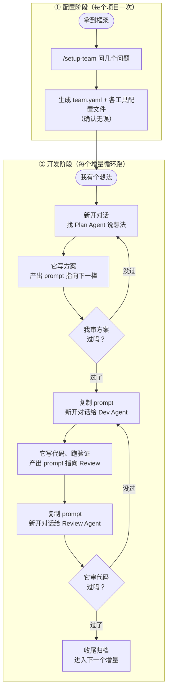

# 多 Agent 协作开发框架

**让你同时开着的几个 AI（Claude Code、Codex……）像一个团队那样接力干活——一个写方案、一个写代码、一个审查，互不串台、每步可查、每步可回滚。**

你只做三件事：**看一眼、复制一段 prompt、开个新对话粘上。** 剩下的上下文搬运、流程记忆、范围圈定，全交给文件和 prompt。

---

## 它能帮你做什么

你手上开着好几个 AI 客户端，想让它们分工：一个负责出方案，一个负责写代码，一个负责挑毛病。但它们各聊各的，谁也看不见谁干了什么，你得在中间不停地复制粘贴、还总怕它们改串了。

这套框架把这件事变简单：

- **分工明确**：每个 AI 担一个或几个固定角色（planner / developer / reviewer……），各管各的文件，不越界。
- **交接顺滑**：一个 AI 干完，自动给你写好"下一段该对谁说什么"的 prompt，你复制粘贴即可。
- **全程可控**：每次交接都是一个天然的检查点——你看一眼没问题，再放行下一步，随时可以打回去重来。
- **不丢上下文**：所有交接信息都写进项目里的共享文件，新对话读文件就接得上，不依赖任何一个 AI 的聊天记录。

一句话：**信息不留在聊天里，全部落到文件上。**

---

## 30 秒上手

```bash
# 1. 拿到框架（二选一）
#    新项目：GitHub 点 "Use this template" 生成新 repo
#    已有项目：在项目根目录跑
./init.sh

# 2. 用 Claude Code 打开项目，运行配置向导
/setup-team          # 它会问你几个问题，自动生成配置

# 3. 确认生成的配置无误后，开始第一个增量
#    新开一个对话，找担任 planner 的 AI，说出你的想法
```

就这三步。下面是细节。

---

## 整体流程一图看懂



每个方框之间的箭头，就是你要做的全部操作：**看一眼、复制 prompt、开新对话粘贴。**

---

## 第一步：配置你的团队（每个项目一次）

跑 `/setup-team`，它会问你几个问题，你点头确认推荐值就行：

1. **用哪几个角色？** planner（出方案）/ developer（写代码）/ reviewer（审查）……按需取舍。小项目可能只要 dev + review；大项目可以 plan + dev + test + review 全上。
2. **你开了几个 AI、各是什么工具？** 比如一个 Claude Code、一个 Codex。
3. **每个 AI 担哪些角色？** 一个 AI 可以兼多个角色（比如 Claude Code 同时当 planner 和 reviewer）。
4. **交接逻辑？** 每一步干完，下一棒交给谁。
5. **身份签名用什么风格？** 见下方「身份锚点」，10 选 1，默认打卡盖章。

答完，向导自动写出 `team.yaml`（你这个项目的唯一配置文件），并据此生成每个工具能直接读的配置（Claude Code 的 `CLAUDE.md`、Codex 的 `AGENTS.md`）。

> **想精确控制？** 也可以直接手写 `team.yaml` 再跑 `python3 core/generate.py`。字段含义见 [`core/team.schema.yaml`](core/team.schema.yaml) 的注释，样例见 [`examples/README.md`](examples/README.md)。

改了团队编制（换工具、加角色），只动 `team.yaml` 重新生成，流程不变。

---

## 第二步：每个增量怎么跑

配置好后，每个新增量都走同一条循环：

1. **找 Plan Agent**：新开一个对话，对担任 planner 的 AI 说出你的想法。它会调研、写需求和方案。
2. **你审方案**：看一眼。不满意就让它改；满意，它会**给你一段写好的 prompt，并指明下一个该找谁**。
3. **交接给 Dev Agent**：复制那段 prompt，**新开一个对话**粘给 developer。它写代码、跑验证，再产出指向 reviewer 的 prompt。
4. **交接给 Review Agent**：复制 prompt，**再新开一个对话**粘给 reviewer。审过了就收尾归档；没过，它产出"打回去改"的 prompt，回到第 3 步。

**你在整个循环里只有三个动作：看一眼、复制 prompt、开新对话粘贴。**

### 交接 prompt 长什么样

AI 干完不会甩你一堆散文，而是固定的"我 + 指向 + 待复制 prompt"三段式，让你一眼看懂、直接复制：

```
✅ 我（登录改版 · developer）的活干完了：实现了短信验证码登录，跑过 8 条单测。
👉 请把下面这段复制给 reviewer（新开一个对话）：
—————（复制从这里开始）—————
你是「登录改版 · reviewer」。读 handoff.md 的修改范围，审 auth/sms.py，
跑 pytest tests/auth，过了把 STATUS 设成 APPROVED。约束：别碰 config2.yaml。
—————（复制到这里结束）—————
```

你只需把虚线之间那段抠出来，开新对话粘给下一个 AI。

---

## 几条用起来必须知道的规矩

这几条直接影响你的使用体验，照做能少踩坑。

### 一个角色一个独立对话

planner、developer、reviewer 各用一个独立的新对话，**别在同一个对话里串着扮演多个角色。**

为什么：如果一个 AI 在同一对话里既写方案又审自己的代码，它会被自己的前文带节奏，审查时倾向于认同刚写的东西，失去独立视角。**独立对话 = 独立上下文 = 真正的相互制衡。** 对话之间靠文件接力，不靠记忆接力。

### 先配置，再开干活的窗口

`CLAUDE.md` / `AGENTS.md` 是每个 AI **启动时读一次**的常驻文件。

- **正确顺序**：先跑 `/setup-team` → 确认这些文件已生成 → 再开那几个干活的窗口。
- **配置前就开着的窗口**：它启动时还没读到最新规矩，**必须重启**（CLI 退出重开 / App 新开对话）才能生效。
- **配置后才新开的窗口**：启动即读到，不用重启。

### 怎么确认一个窗口"就位"了

你把交接 prompt 粘进去后，它**第一句**应该先回执身份，证明读懂了规矩：

> 收到。我是「登录改版 · reviewer」，已读 START_HERE 和 handoff.md，当前 STATUS=DEV_DONE，确认轮到我，开始干活。

如果它闷头就做、不回执，说明没把规矩读进去。Claude Code 还可以随时敲 `/whoami` 主动自检——它会当场报"我担任什么角色、轮没轮到我、当前状态、下一步"。

---

## 身份锚点：一眼看出 AI 有没有"断片"

多对话协作最怕的事：某个 AI 聊着聊着上下文被压缩，忘了自己是"哪个产品的哪个角色"，开始越界乱改。

**身份锚点**就是对付这个的：每个 AI 在每轮回复的**最后一行**，固定加一句身份签名，内核永远是「**<产品/增量> · <角色>**」：

> —— 🦉「登录改版 · reviewer」打卡下班，搬砖完毕。

它替你干两件事：

1. **让 AI 时刻自我确认身份**——每轮都署名，就不容易跑偏成别的角色。
2. **当探测器用**——某轮回复**没带这行签名**，几乎可以肯定它丢了上下文。你直接回一句「你是谁？」，它就会重新声明身份、找回状态。这是一个**免费的"AI 健康仪表盘"**：签名在 = 神志清醒，签名没了 = 该拉回来了。

**签名风格可选**，配置时定，10 种预设任挑（改风格重跑生成器即可）：

| 风格 | 示例 |
| :-- | :-- |
| `stamp` 打卡盖章（默认，每个角色一只吉祥物） | —— 🦉「登录改版 · reviewer」打卡下班，搬砖完毕。 |
| `radio` 电台呼号 | 📻 这里是「登录改版 · reviewer」，本轮完毕，over～ |
| `butler` 管家侍从 | 🎩 您的「登录改版 · reviewer」已为您效劳完毕，主人。 |
| `cat` 猫咪卖萌 | 🐾 喵——🦉「登录改版 · reviewer」干完活了，求摸头。 |
| `save` / `chunni` / `express` / `captain` / `wuxia` / `terminal` | 游戏存档 / 中二 / 快递 / 机长 / 武侠 / 极客终端，详见 [`core/team.schema.yaml`](core/team.schema.yaml) |

> 内核（产品 · 角色）不能省——那才让探测器有效；外壳只是让它好认、好玩。

---

## 同时跑几个产品？

你可能在一个目录里同时推进好几个开发，希望它们互不干扰。两种办法：

- **各自独立子目录（最常见，推荐）**：每个产品一个子目录，各跑一次 `init.sh` + `/setup-team`，两套总线物理隔离，互相看不见。**框架本身不用做任何特殊配置**——隔离边界就是目录。
- **共享同一份代码**：没法分目录时，靠 `team.yaml` 的 `bus.dir` 把两套总线指到不同目录（如 `docs/agent-collab-p1` 和 `-p2`），各跑一次生成器，互不踩踏。

简单记：**能分目录就分目录；只有共享 codebase 才动 bus.dir。**

---

## 目录结构

```
multiagent-workflow/
├─ README.md             # 本文件
├─ init.sh               # 把框架铺进一个已有项目
├─ team.yaml             # （配置后生成）你这个项目的唯一配置
├─ core/                 # 工具无关的协作契约（真正的核心）
│  ├─ team.schema.yaml   #   配置格式定义 + 默认编制 + 10 种锚点风格
│  ├─ generate.py        #   配置生成器（/setup-team 调它）
│  ├─ status-machine/    #   STATUS 状态机模板
│  └─ bus-templates/     #   共享文件总线模板
├─ adapters/             # 各工具的薄适配层（从 team.yaml 生成）
│  ├─ claude-code/       #   /setup-team /whoami /plan /review /sync
│  ├─ codex/             #   AGENTS.md 模板
│  └─ cursor/            #   占位，未来接入
├─ examples/             # 一个填好 team.yaml 的样例
└─ docs/                 # 设计原理（为什么这么做）
```

想了解"为什么这么设计"，看 [`docs/DESIGN.md`](docs/DESIGN.md)。

---

## 设计原则速记

- **角色与工具解耦**：角色是"要干的活"，工具是"谁来干"。配置在 team.yaml，适配在 adapters。
- **人工编排是 feature 不是妥协**：每个节点 = 审查点 + commit 点 + 交接点。
- **文件即真相**：跨 AI 的一切（需求、方案、交接、审查）落文件，不留聊天里。
- **一个角色一个对话**：保证上下文干净和独立视角。
- **身份锚点**：每轮署名「产品 · 角色」，丢了锚点就是丢了上下文。
- **小步可回滚**：一个增量一条循环，每个节点一次 commit。

