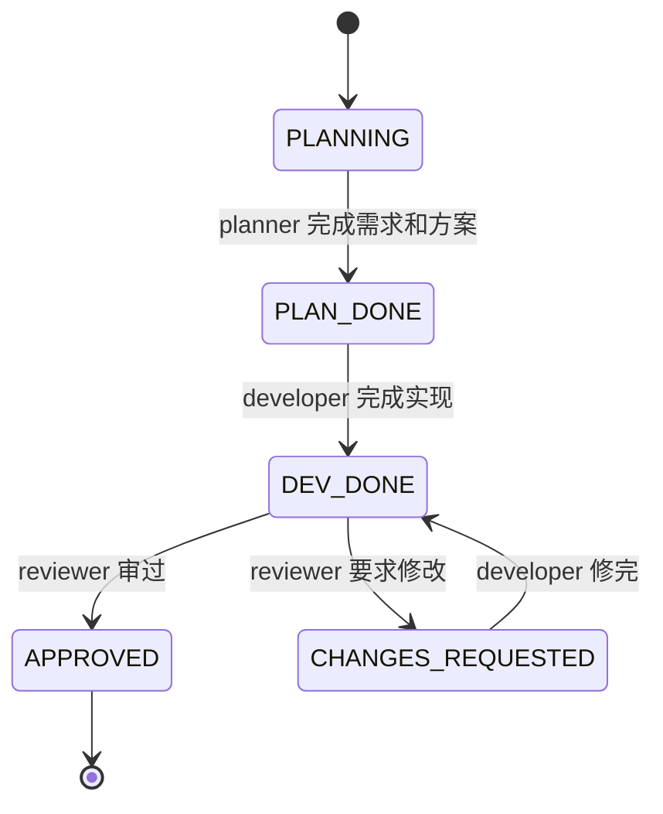

# Agent Emperor

<p align="center">
  
</p>

<p align="center">
  <a href="https://fu-fangteng.github.io/agent-emperor/"><strong>官网</strong></a>
  ·
  <a href="https://github.com/Fu-fangteng/agent-emperor"><strong>GitHub 仓库</strong></a>
</p>

> **Be your agents' emperor.** 把多个 AI 对话组织成一个可检查、可回滚、可接力的开发团队。

Agent Emperor 是一个轻量的多 Agent 协作框架模板。它不追求把所有 AI 自动串起来，而是把协作规则、角色分工、状态流转和交接内容落到项目文件里，让 Claude Code、Codex 等工具能在独立对话中按同一套契约接力。

你在循环里只做三件事：

1. 看一眼当前交接内容。
2. 复制框架准备好的转达 prompt。
3. 新开对应角色的对话并粘贴。

上下文不靠聊天记录续命，全部落在仓库里的文件总线上。

## 适合什么场景

- 你同时使用 Claude Code、Codex 或多个同类 AI 对话，希望它们分工协作。
- 你希望 planner / developer / reviewer / tester 等角色互相制衡，而不是在同一段上下文里自写自审。
- 你需要每一步都有文件证据：需求、方案、实现交接、审查意见、决策记录。
- 你希望人工保留节奏控制：每个 STATUS 节点都是检查点、交接点，也可以是 commit 点。

不适合的场景：

- 你想要完全自动的 agent swarm。
- 你不想维护任何项目内配置文件。
- 你只做一次性小问答，不需要跨对话接力。

## 核心概念

### Front Desk

前台是你唯一直接打交道的入口。它负责两件事：

- 首次配置团队：生成或修正 `team.yaml`，再运行生成器。
- 后续分拣请求：根据当前 STATUS 和你的需求，产出给某个 worker 的转达 prompt。

前台不写代码、不写方案、不写 review，也不自动驱动下一个 worker。它停在“给你一段 prompt”。

Claude Code / Codex 中对应 skill：`/setup-team`。

### Worker

worker 是真正干活的 AI 对话。每个 worker 接到转达 prompt 后，先读 `team.yaml` 和当前 `handoff.md`，再检查两道锁：

- 时序锁：当前 STATUS 是否轮到我这个 role。
- 能力锁：这件事是否属于我的职责；不能写代码的 role 不准改源码。

通过后才工作。对应 skill：`/act`。

### 文件总线

跨 agent 的事实源在 `docs/agent-collaboration/`：

```text
docs/agent-collaboration/
├─ START_HERE.md
└─ phases/
   └─ v1/
      ├─ requirements.md
      ├─ plan.md
      ├─ handoff.md
      ├─ review.md
      ├─ decisions.md
      └─ rounds/INDEX.md
```

`handoff.md` 顶部的 STATUS 块是指挥棒。任何 worker 接手前都先看它。

### 转达 prompt

转达 prompt 是唯一接力棒。典型格式：

```text
✅ 我（项目 · developer）的活干完了：完成实现并跑过验证。
👉 请把下面这段复制给 reviewer（新开一个对话）：
—————（复制从这里开始）—————
你是「项目 · reviewer」（agent: cc）。读 team.yaml、START_HERE.md、当前 handoff.md 和本轮 diff，
确认 STATUS=DEV_DONE 且轮到你；按 reviewer 职责审查，产出 review.md。
约束：只读源码，不改配置文件。
—————（复制到这里结束）—————
```

## 快速开始

### 0. 准备依赖

需要 Python 3 和 PyYAML：

```bash
python3 -m pip install pyyaml
```

### 1. 安装到你的项目

不要在 Agent Emperor 仓库自身里直接跑初始化。这个仓库是模板。

已有项目：

```bash
./init.sh /path/to/your/project
```

新项目可以用 GitHub 的 “Use this template”，或先 clone 后把框架铺到目标项目。

`init.sh` 会复制：

- `core/`：schema、生成器、总线模板。
- `.claude/skills/` 和 `.agents/skills/`：四个触发器。
- `docs/agent-collaboration/`：文件总线初始模板。
- `team.yaml`：默认编制模板。

已有文件不会被覆盖。

### 2. 配置团队

在目标项目根目录打开你的 AI 工具，运行：

```text
/setup-team
```

`init.sh` 会复制一份默认 `team.yaml`，但这不代表项目已经配置完成。`/setup-team` 会把以下情况视为“未配置”，进入登记模式：

- 没有 `team.yaml`。
- `team.yaml.project.name` 仍是 `my-project`。
- 当前 `handoff.md` 仍有 `<填入...>` 占位符。
- 你明确要求“初始化 / 配置团队 / 重新登记”。

前台会问清：

- 项目名。
- 启用哪些 role。
- 开几个 agent、各自使用什么工具。
- 每个 agent 担任哪些 role。
- 是否采用默认 plan -> dev -> review 流程。

文件总线 ownership、受保护配置文件和身份锚点风格都有默认值；只有你要自定义时才需要改。

确认后它会运行：

```bash
python3 core/generate.py --team team.yaml --target . --dry-run
python3 core/generate.py --team team.yaml --target .
```

生成：

- `CLAUDE.md`：Claude Code 读取的协作协议。
- `AGENTS.md`：Codex 读取的协作协议。

同一个工具可以配置多个 agent。生成器会把同一工具的 agent 合并写入同一份原生配置文件，不会互相覆盖；具体某个对话扮演哪个 agent / role，由转达 prompt 指定。

### 3. 重启旧 worker 窗口

`CLAUDE.md` / `AGENTS.md` 通常在新对话启动时读取。配置完成后，关掉配置前已经打开的 worker 对话，再开新的。

### 4. 开始一个增量

回到前台窗口，对 `/setup-team` 说你要做什么：

```text
我要给登录页增加邮箱验证码登录。
```

前台会读当前 STATUS，判断该交给哪个 role，并产出转达 prompt。你复制给对应 worker 的新对话。

worker 执行 `/act`，完成后更新文件总线并产出下一棒 prompt。

循环直到 STATUS 到达 `next_role: null` 的收尾态，例如 `APPROVED`。

## team.yaml 结构

`team.yaml` 是唯一编制配置。

```yaml
version: 1

project:
  name: my-project
  repos:
    - .

roles:
  - name: planner
    desc: 写需求和方案，明确范围、验收标准和实施计划
    can_write_code: false
  - name: developer
    desc: 修改源代码、运行验证、维护交接说明
    can_write_code: true
  - name: reviewer
    desc: 独立审查 diff 和测试结果，输出 P0-P3 findings
    can_write_code: false

agents:
  - name: cc
    tool: claude-code
    roles: [planner, reviewer]
  - name: codex
    tool: codex
    roles: [developer]

handoff:
  - { state: PLANNING, next_role: planner, human_gate: false, on_done: PLAN_DONE }
  - { state: PLAN_DONE, next_role: developer, human_gate: true, on_done: DEV_DONE }
  - state: DEV_DONE
    next_role: reviewer
    human_gate: true
    transitions:
      - { result: "审查通过", state: APPROVED }
      - { result: "需要修改", state: CHANGES_REQUESTED }
  - { state: CHANGES_REQUESTED, next_role: developer, human_gate: true, on_done: DEV_DONE }
  - { state: APPROVED, next_role: null, human_gate: true }
```

字段要点：

- `roles[].can_write_code` 决定能力锁。
- `agents[].tool` 目前支持生成 `claude-code` 和 `codex`。
- `handoff[].next_role` 表示当前 STATUS 轮到谁接手。
- `handoff[].on_done` 表示常规完成后进入哪个 STATUS。
- `handoff[].transitions` 表示分支结果及目标 STATUS。
- `bus.ownership` 决定每份总线文件谁能写。
- `handoff.md` 顶部 STATUS 块是指挥棒，当前轮到的 role 完成后可以更新；正文仍按 `bus.ownership` 归属维护。
- `config_files` 声明任何 agent 都不能擅自修改的敏感配置文件。
- `anchor` 决定每轮回复结尾的身份锚点风格。

完整字段说明见 [core/team.schema.yaml](core/team.schema.yaml)，样例见 [examples/README.md](examples/README.md)。

## 四个触发器

| 触发器 | 用途 | 是否写文件 |
| :-- | :-- | :-- |
| `/setup-team` | 前台：登记团队或分拣请求，产出转达 prompt | 可写 `team.yaml`，可运行生成器 |
| `/act` | worker：按当前 STATUS 和 role 职责干活 | 只写自己 ownership 内的文件 |
| `/sync` | 全局状态对齐：现在轮到谁、下一步给谁 | 只读 |
| `/whoami` | 当前窗口自检：我是谁、是否轮到我 | 只读 |

## 状态机示例

默认编制是 plan -> dev -> review：



你可以整套替换角色和状态。例如安全审计项目可以用 `analyst / pentester / auditor`。

## 身份锚点

身份锚点是每个 worker 每轮回复最后一行的固定签名。它不是装饰，而是一个低成本的上下文探测器。

多 agent 协作最怕的是某个对话压缩上下文后忘了自己是谁、当前产品是什么、能不能写代码。身份锚点要求 agent 每轮都把“产品 / 增量 + role”写出来：

```text
—— 🦉「internal-wiki/v1 · reviewer」打卡下班，搬砖完毕。
```

这行有两个作用：

- 让 agent 在输出结尾重新确认自己的身份。
- 让人一眼看出它有没有丢上下文。某轮回复如果没有锚点，或者 role 错了，就先让它 `/whoami` 自检，不要继续交接。

锚点的内核永远是：

```text
「<产品/增量> · <role>」
```

外壳只是风格。默认产品名来自 `team.yaml.project.name`；如果转达 prompt 指定了增量名，以 prompt 为准。

在 `team.yaml` 中配置：

```yaml
anchor:
  style: stamp
  role_emoji:
    planner: 🦝
    developer: 🦫
    reviewer: 🦉
```

### 10 种预设风格

| style | 示例 |
| :-- | :-- |
| `stamp` | —— 🦉「项目 · reviewer」打卡下班，搬砖完毕。 |
| `radio` | 📻 这里是「项目 · reviewer」，本轮完毕，over～ |
| `butler` | 🎩 您的「项目 · reviewer」已为您效劳完毕，主人。 |
| `save` | 💾 [项目 · reviewer] 进度已保存，等待下一位玩家接棒。 |
| `chunni` | ⚔️ 以「项目 · reviewer」之名，本轮承诺已兑现。 |
| `express` | 📦 「项目 · reviewer」专递已送达，请签收～ |
| `captain` | ✈️ 机长「项目 · reviewer」播报：本段航程结束，感谢搭乘。 |
| `cat` | 🐾 喵——🦉「项目 · reviewer」干完活了，求摸头。 |
| `wuxia` | 🥋 在下「项目 · reviewer」，本轮告一段落，告辞。 |
| `terminal` | [项目 · reviewer] $ done ✓ — awaiting next handoff |

`role_emoji` 只在 `stamp` 和 `cat` 风格中使用；未配置的 role 会回退到默认符号。改完锚点配置后，重新运行：

```bash
python3 core/generate.py --team team.yaml --target .
```

然后重启旧 worker 对话，让新锚点进入 `CLAUDE.md` / `AGENTS.md`。

## 常见问题

### 只有一个 AI 能用吗

能。让一个 agent 兼任多个 role，然后每个 role 新开独立对话。隔离来自“新对话”，不是来自工具数量。

### 两个 Codex 或两个 Claude Code 会互相覆盖配置吗

不会。生成器按工具生成一份 `AGENTS.md` 或 `CLAUDE.md`，里面列出该工具下的所有 agent。转达 prompt 会指定本窗口扮演哪个 agent / role。

### 为什么不全自动流转

人工节点是设计目标。每个 STATUS 是检查点、交接点、可选 commit 点。你保留节奏控制，agent 保持职责边界。

### 为什么 reviewer 不能顺手改代码

这是能力锁。独立审查的价值在于只读源码、写 review。如果 reviewer 发现问题，应把 STATUS 打回 developer。

### 可以删除官网文件吗

可以。仓库根的 `index.html`、`logo*.webp`、`avatar*.webp`、`bg*.webp` 是 Agent Emperor 自己的展示页素材，不是框架运行必需文件。把框架装进你的业务项目后，不需要保留这些官网素材。

## 升级已有项目

在 Agent Emperor 仓库中拉到新版本后，对目标项目运行：

```bash
./init.sh --upgrade /path/to/your/project
```

升级只覆盖框架层：

- `core/`
- `.claude/skills/`
- `.agents/skills/`

不会触碰实例层：

- `team.yaml`
- 业务代码
- `docs/agent-collaboration/phases/*` 里的产物
- `.gitignore` 和本机配置

升级后建议重新运行：

```bash
python3 core/generate.py --team team.yaml --target .
```

再重启旧 worker 对话。

## 仓库结构

```text
agent-emperor/
├─ README.md
├─ init.sh
├─ core/
│  ├─ team.schema.yaml
│  ├─ generate.py
│  ├─ framework-manifest.txt
│  ├─ status-machine/
│  └─ bus-templates/
├─ .claude/skills/
├─ .agents/skills/
├─ examples/
├─ docs/
├─ assets/
└─ index.html
```

## 设计原则

- 角色与工具解耦：role 是职责，tool 是承载它的 AI 工具。
- 文件即真相：跨对话上下文落在仓库，不留在聊天里。
- 双重硬约束：先确认轮到谁，再确认能不能做。
- 一 role 一对话：保持上下文干净，避免自写自审。
- 状态显式：`on_done` 和 `transitions` 让下一步可检查。
- 人工编排：每个节点都可审查、可暂停、可回滚。

更多设计背景见 [docs/DESIGN.md](docs/DESIGN.md)。
