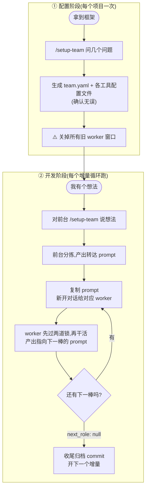

# Agent Emperor

<p align="center">
  
</p>

<p align="center">
  <a href="#"><strong>官网建设中 · Coming soon</strong></a>
</p>

> **Be your agents' emperor.** 你是皇帝,百官各司其职。

多 Agent 协作开发框架——**让你同时开着的几个 AI(Claude Code、Codex……)像一个团队那样接力干活:一个写方案、一个写代码、一个审查,互不串台、每步可查、每步可回滚。**

你只做三件事:**看一眼、复制一段 prompt、开个新对话粘上。** 剩下的上下文搬运、流程记忆、范围圈定,全交给文件和 prompt。

---

## 它能帮你做什么

你手上开着好几个 AI 客户端,想让它们分工:一个负责出方案,一个负责写代码,一个负责挑毛病。但它们各聊各的,谁也看不见谁干了什么,你得在中间不停地复制粘贴、还总怕它们改串了。

这套框架把这件事变简单:

- **分工明确**:每个 AI 担一个或几个角色(例如 planner / developer / reviewer,也可以整套替换),各管各的文件,不越界。
- **交接顺滑**:一个 AI 干完,自动给你写好"下一段该对谁说什么"的 prompt,你复制粘贴即可。
- **全程可控**:每次交接都是一个天然的检查点——你看一眼没问题,再放行下一步,随时可以打回去重来。
- **不丢上下文**:所有交接信息都写进项目里的共享文件,新对话读文件就接得上,不依赖任何一个 AI 的聊天记录。

一句话:**信息不留在聊天里,全部落到文件上。**

---

## 三个核心概念

读完这三个,后面所有内容你都看得懂。

### 1. 前台(Front Desk)

**你唯一打交道的入口。** 你不直接对 worker 说话,所有想法、指令、问题都先扔给前台。它干两件事:

- 第一次用,帮你**配团队**(问几个问题,生成 `team.yaml`)
- 之后每次,听你想干啥,**判断该交给哪个角色**,给你写一段"转达 prompt"

前台**不亲自下场**——它不写代码、不写方案、不写 review,也不会替你把 prompt 自动推给下一个窗口。它只到"给你一段 prompt"为止。

> 🏛 在 Claude Code 里,前台就是 `/setup-team` 这个命令。

### 2. Worker(干活的 agent)

**真正写东西的那些 AI 窗口。** 每个 worker 担一个或几个角色(planner / developer / reviewer……),你给它粘一段转达 prompt,它就读项目里的共享文件、按职责干活、再给你写下一棒的转达 prompt。

每个角色用**独立的对话窗口**——developer 一个窗口、reviewer 一个窗口。它们之间不靠聊天记忆接力,靠**项目里的共享文件**接力。

> 🏛 在 Claude Code 里,worker 窗口干活用 `/act` 命令。

### 3. 转达 prompt(接力棒)

**前台和 worker 之间、worker 和 worker 之间唯一的传递物。** 一段固定格式的文字:

```
✅ 我(项目名称 · developer)的活干完了:完成本轮实现并跑过验证。
👉 请把下面这段复制给 reviewer(新开一个对话):
—————(复制从这里开始)—————
你是「项目名称 · reviewer」。读 team.yaml、handoff.md 顶部 STATUS,
按你的 role 职责审查本轮 diff。约束:别碰 config2.yaml。
—————(复制到这里结束)—————
```

**你的全部操作就是**:把虚线之间那段抠出来,**新开一个对话**粘进去。

---

## 端到端跑一遍

跟着做就能跑通第一个增量。以"装框架 → 配团队 → 起第一个增量 → 收尾"为序。

### Step 0. 装框架

```bash
# 依赖:python3 + PyYAML
pip install pyyaml

# 新项目:GitHub 点 "Use this template" 生成新 repo,直接 clone 下来
# 已有项目:在项目根目录跑
./init.sh
```

`init.sh` 会按 `core/framework-manifest.txt` 清单铺好骨架:`core/`(生成器 + schema + 模板)、`.claude/skills/` + `.agents/skills/`(四个触发器)、`docs/agent-collaboration/` 总线目录、`team.yaml` 默认模板。已存在的文件不覆盖。

> ⚠️ **不要在 Agent Emperor 仓库自身里使用框架**。这个 repo 本身是**模板**(像 React 的 create-react-app 一样)。要么用 GitHub 的 "Use this template" 新建你的项目 repo,要么 clone 它后跑 `./init.sh /path/to/你自己的项目目录`。在父类 repo 里直接跑 `/setup-team`,前台会读到默认的 schema 当作"已配置",体验会跑偏。

### Step 1. 配团队(每个项目一次)

用 Claude Code 在项目根目录新开一个对话,跑:

```
/setup-team
```

前台会问你 5 件事(都给推荐值,你点头就行,也能描述完让它解析):

| 它问什么 | 怎么答 |
| :-- | :-- |
| 项目/产品叫什么名 | 一个短名,会成为身份签名里的"产品名" |
| 用哪几个角色 | 候选:planner / developer / reviewer / tester / release-manager;也可以自定义,比如"安全审计员" |
| 开了几个 AI、各是什么工具 | 比如"一个 Claude Code、一个 Codex";**只有一个 AI 也行**,见下方提示 |
| 每个 AI 担哪些角色 | 一个 AI 可以兼多个(比如 cc 同时当 planner+reviewer) |
| 交接逻辑 | 每个状态干完交给谁;前台会**主动追问没想清楚的环节**(比如"reviewer 审完该交回给谁?") |
| 身份签名风格 | 10 选 1(stamp 打卡 / butler 管家 / chunni 中二 ……见下方[身份锚点](#身份锚点一眼看出-ai-有没有断片)) |

> 💡 **只有一个 AI 也能用**(常见场景:独立开发者只用 Claude Code)。让它一个 agent 兼任所有角色,你**新开不同对话**让它分别扮演 planner / developer / reviewer——CLAUDE.md 是常驻文件,每个新对话起手都会读到双重硬约束 + 当前 STATUS,自然进入对应角色。本质上,"独立对话"靠的是**对话隔离**,不是 agent 隔离。

答完,前台会:
1. 写出 `team.yaml`(你这个项目的唯一配置文件)
2. 跑 `python3 core/generate.py`,生成各工具的适配文件(`CLAUDE.md` / `AGENTS.md`)

> 💡 想精确控制:也可以直接手写 `team.yaml` 再跑 `python3 core/generate.py`。字段说明见 [`core/team.schema.yaml`](core/team.schema.yaml),完整样例见 [`examples/README.md`](examples/README.md)。

### ⚠️ Step 1.5. 关键 gotcha:配完团队后,关掉所有旧的 worker 窗口

`CLAUDE.md` / `AGENTS.md` 是每个 AI **启动时读一次**的常驻文件。

- 配置前就已经开着的 worker 窗口,**启动时还没读到最新规矩**,必须**重启**(CLI 退出重开 / App 新开对话)才能生效。
- 配置后才新开的窗口,启动即读到,不用重启。

**正确顺序**:跑 `/setup-team` → 确认 `CLAUDE.md` 和 `AGENTS.md` 已生成 → 再开干活的窗口。

### Step 2. 起第一个增量

回到你那个跑过 `/setup-team` 的窗口(还是前台),把想法甩给它:

```
我要做 XXX 功能。
```

前台会:
1. 读 `team.yaml` 和当前 `handoff.md` 的 STATUS
2. 判断该交给哪个角色(比如 planner)
3. 如果你这句话太含糊,**先反问一句澄清**
4. 产出一段**转达 prompt**

你的动作:把转达 prompt 里虚线之间那段抠出来。

### Step 3. 交接给 worker

**新开一个对话**(planner 窗口),把刚抠出来的那段粘进去。

worker 会**先回执身份**——这是它读懂规矩的证明:

> 收到。我是「项目名称 · planner」,已读 START_HERE 和 handoff.md,当前 STATUS=PLANNING,确认轮到我,开始干活。

**如果它闷头就做、不回执**,说明没把规矩读进去——可能是 Step 1.5 没做(没重启窗口)、或者配置文件没生成成功。这时候敲 `/whoami` 让它当场自检,或者干脆**关掉这个窗口**重新开一个。

worker 在动手前,还会自动跑**两道安全锁**:

- **时序锁**:当前 STATUS 轮到的角色是我吗?不是 → 停,回你"现在轮到 X,请切到担任 X 的 agent"。
- **能力锁**:这事在我职责内吗?尤其要改源代码、但我 `can_write_code=false` → 停,回你"改代码不归我,应交给 developer 类角色"。

两道锁都过了,才开始干活。

### Step 4. 干完,接下一棒

worker 干完会:
1. 更新 `handoff.md` 顶部 STATUS 块(新状态、轮到谁、更新时间)
2. 产出一段**新的转达 prompt**,指向下一棒(比如 planner 完了指向 developer)

你的动作:**抠 prompt → 新开对话 → 粘**。回到 Step 3 循环。

### Step 5. 收尾

当某棒的转达 prompt 不再指向下一个 worker,而是说"本增量到此收尾,建议 commit 并归档",就完事了。这一棒在 `team.yaml` 里对应的状态 `next_role: null`。

```bash
git add . && git commit -m "feat: <增量名> 完成"
```

下一个增量,回到 Step 2 循环。

---

## 整体流程一图看懂



**你在整个循环里只有三个动作:看一眼、复制 prompt、开新对话粘贴。**

---

## 触发器(skill)速查

Claude Code 里四个 `/` 命令,涵盖"配置 → 干活 → 自检 → 对齐":

| 触发器 | 谁敲 | 干嘛 |
| :-- | :-- | :-- |
| `/setup-team` | 你(对前台) | 没配过就登记团队、生成配置;配过了就分拣你的请求、产出转达 prompt |
| `/act` | worker 窗口 | 按 `team.yaml` + 当前 STATUS,以"轮到的那个角色"身份干活,先过两道锁再动手 |
| `/whoami` | 任意窗口 | 当场自检:"我担任什么角色、轮没轮到我、当前 STATUS、下一步"。**纯只读** |
| `/sync` | 任意窗口 | 看全局:"项目现在卡在哪个 STATUS、轮到谁、你该切到哪个 agent"。**纯只读** |

`/act` 是**通用的**——它不绑定任何固定角色名,角色、职责、读写范围全部从 `team.yaml` 现读现用,所以它**绝不会幻觉出一个你没定义的角色**。`/whoami` 看"我自己",`/sync` 看"整盘棋"。

---

## 核心机制:为什么这套靠谱

三个机制叠在一起,把多 agent 协作最常翻车的几件事堵死。

### 两道安全锁

多 AI 协作最容易翻车的两件事:**没轮到的 AI 被你一句话带偏、动手干了别人的活;以及只能看不能改的 AI(比如 reviewer)直接动了代码。** 这套框架在每个 worker 接到 prompt 的**第一步**就强制跑两道锁,任一不过就立刻停手:

- **时序锁**:worker 先读 `handoff.md` 顶部 STATUS,确认"当前轮到的角色就是我"。
- **能力锁**:worker 确认"这事在我职责内",尤其能不能改源代码——由 `team.yaml` 里那个角色的 `can_write_code` 字段说了算。

**即使你在那个窗口里直接命令它做职责外的事,它也会顶回来、不照做。** 这不是不配合,是框架替你挡住了"手滑在错误的窗口里下指令"这种最常见的事故。

### 一个角色一个独立对话

planner / developer / reviewer 各用一个独立的新对话,**别在同一个对话里串着扮演多个角色。**

为什么:如果一个 AI 在同一对话里既写方案又审自己的代码,它会被自己的前文带节奏,审查时倾向于认同刚写的东西,**失去独立视角**。独立对话 = 独立上下文 = 真正的相互制衡。对话之间靠**文件**接力,不靠**记忆**接力。

### 身份锚点:一眼看出 AI 有没有"断片"

多对话协作最怕的事:某个 AI 聊着聊着上下文被压缩,忘了自己是"哪个产品的哪个角色",开始越界乱改。

**身份锚点**就是对付这个的:每个 AI 在每轮回复的**最后一行**,固定加一句身份签名,内核永远是「**<产品/增量> · <角色>**」:

> —— 🦉「项目名称 · reviewer」打卡下班,搬砖完毕。

它替你干两件事:

1. **让 AI 时刻自我确认身份**——每轮都署名,就不容易跑偏成别的角色。
2. **当探测器用**——某轮回复**没带这行签名**,几乎可以肯定它丢了上下文。你直接回一句「你是谁?」,它就会重新声明身份、找回状态。

**签名风格 10 选 1**(配置时定,改风格重跑生成器即可):

| 风格 | 示例 |
| :-- | :-- |
| `stamp` 打卡盖章(默认,每个角色一只吉祥物) | —— 🦉「项目名称 · reviewer」打卡下班,搬砖完毕。 |
| `radio` 电台呼号 | 📻 这里是「项目名称 · reviewer」,本轮完毕,over~ |
| `butler` 管家侍从 | 🎩 您的「项目名称 · reviewer」已为您效劳完毕,主人。 |
| `save` 游戏存档 | 💾 [项目名称 · reviewer] 进度已保存,等待下一位玩家接棒。 |
| `chunni` 中二宣言 | ⚔️ 以「项目名称 · reviewer」之名,本轮承诺已兑现。 |
| `express` 快递签收 | 📦 「项目名称 · reviewer」专递已送达,请签收~ |
| `captain` 机长广播 | ✈️ 机长「项目名称 · reviewer」播报:本段航程结束,感谢搭乘。 |
| `cat` 猫咪卖萌 | 🐾 喵——🦉「项目名称 · reviewer」干完活了,求摸头。 |
| `wuxia` 武侠抱拳 | 🥋 在下「项目名称 · reviewer」,本轮告一段落,告辞。 |
| `terminal` 终端提示符 | [项目名称 · reviewer] $ done ✓ — awaiting next handoff |

> 内核(产品 · 角色)不能省——那才让探测器有效;外壳只是让它好认、好玩。

---

## 进阶

### 框架升级:父类改了,老项目怎么同步

框架本身(Agent Emperor)会持续迭代。已经在用的老项目,想把新能力同步下来、**又不动你自己的业务成果**,跑一条命令:

```bash
./init.sh --upgrade /path/to/your/project
```

它按"三层模型"工作:

- **框架层(镜像覆盖)**:`core/` 下的生成器和模板、`.claude/skills/*` 触发器等——以 `core/framework-manifest.txt` 为清单,强制覆盖到最新,并删掉已废弃的旧框架文件。
- **实例层(绝不触碰)**:你的 `team.yaml`、业务代码、素材、各 phase 的产物、`.gitignore`、本机配置——清单没列的一律不动。
- **生成层(重新生成)**:`CLAUDE.md` / `AGENTS.md` 是从 `team.yaml` 生成的产物,升级后重跑 `python3 core/generate.py` 刷新即可。

建议升级前先 commit 一次(或 `git tag` 留个回滚锚点),升级后跑 `/setup-team` 让前台用新格式复查一遍旧 `team.yaml`,再重新生成适配文件。

### 同时跑几个产品

两种办法:

- **各自独立子目录(推荐)**:每个产品一个子目录,各跑一次 `init.sh` + `/setup-team`,两套总线物理隔离,互相看不见。**框架本身不用做任何特殊配置**——隔离边界就是目录。
- **共享同一份代码**:没法分目录时,靠 `team.yaml` 的 `bus.dir` 把两套总线指到不同目录(如 `docs/agent-collab-p1` 和 `-p2`),各跑一次生成器,互不踩踏。

简单记:**能分目录就分目录;只有共享 codebase 才动 bus.dir。**

### 自定义角色和状态机

`planner / developer / reviewer` 只是默认示例。你可以整套替换——比如做安全审计项目,可能用 `analyst / pentester / auditor`;做内容运营,可能用 `editor / writer / fact-checker`。

改 `team.yaml` 的 `roles` 和 `handoff` 段即可:
- `roles`:声明角色名、`desc` 一句话职责、`can_write_code` 能否改源码
- `handoff`:每个 STATUS 交给哪个角色,`next_role: null` 表示收尾

详见 [`core/team.schema.yaml`](core/team.schema.yaml) 注释和 [`core/status-machine/README.md`](core/status-machine/README.md)。

---

## 目录结构

```
agent-emperor/
├─ README.md             # 本文件
├─ init.sh               # 把框架铺进已有项目;--upgrade 同步框架层更新
├─ team.yaml             # (配置后生成)你这个项目的唯一配置
├─ core/                 # 工具无关的协作契约(真正的核心)
│  ├─ team.schema.yaml   #   配置格式定义 + 默认编制 + 10 种锚点风格
│  ├─ generate.py        #   配置生成器(/setup-team 调它)
│  ├─ framework-manifest.txt #  升级时哪些是"框架层"(会被镜像覆盖)
│  ├─ status-machine/    #   STATUS 状态机模板
│  └─ bus-templates/     #   共享文件总线模板
├─ .claude/skills/       # Claude Code 触发器:setup-team / act / whoami / sync
├─ .agents/skills/       # 上面四个的镜像(给读 .agents 的工具)
├─ examples/             # 一个填好 team.yaml 的样例
├─ assets/               # 品牌素材(banner / 头像 / logo)
├─ docs/                 # 设计原理(为什么这么做)
├─ index.html            # 产品官网展示页(GitHub Pages 渲染目标,见下)
├─ logo.png              # 官网展示页用的素材(克隆框架时可删)
├─ logo-optimized.webp   # 同上
├─ avatar-optimized.webp # 同上
└─ bg-optimized.webp     # 同上(首屏宫廷赛博背景)
```

> 📺 **关于仓库根的 `index.html` 和那几张图**:这是 Agent Emperor 的**产品官网展示页**,GitHub Pages 直接渲染——访客打开 repo 的 Pages 域名就能看到这套框架的可视化介绍。它本身是用这套框架(planner/developer/reviewer 接力)dogfood 做出来的真实案例。
>
> 如果你只是**拿这个 repo 当框架模板**(`init.sh` 装到你自己项目里、或 `Use this template` 新建项目),这几个文件**可以直接删**——它们不是框架运行的一部分,只是父类自己的官网。

想了解"为什么这么设计",看 [`docs/DESIGN.md`](docs/DESIGN.md)。

---

## 设计原则速记

- **角色与工具解耦**:角色是"要干的活",工具是"谁来干"。配置在 team.yaml,各工具适配文件从它生成。
- **单一人机入口**:你只跟前台说话,它负责澄清+路由,绝不亲自下场、绝不自动驱动下一棒。
- **两道安全锁**:每个 worker 动手前先过时序锁(轮没轮到我)+ 能力锁(这活归不归我、能不能改源码),不过就硬停。
- **角色数据驱动、零硬编码**:角色全部现读 team.yaml,绝不幻觉出未定义的角色。plan-dev-review 只是示例,可整套替换。
- **人工编排是 feature 不是妥协**:每个节点 = 审查点 + commit 点 + 交接点。
- **文件即真相**:跨 AI 的一切(需求、方案、交接、审查)落文件,不留聊天里。
- **一个角色一个对话**:保证上下文干净和独立视角。
- **身份锚点**:每轮署名「产品 · 角色」,丢了锚点就是丢了上下文。
- **小步可回滚**:一个增量一条循环,每个节点一次 commit。
- **三层继承**:框架层可升级覆盖、实例层绝不触碰、生成层重新生成。


