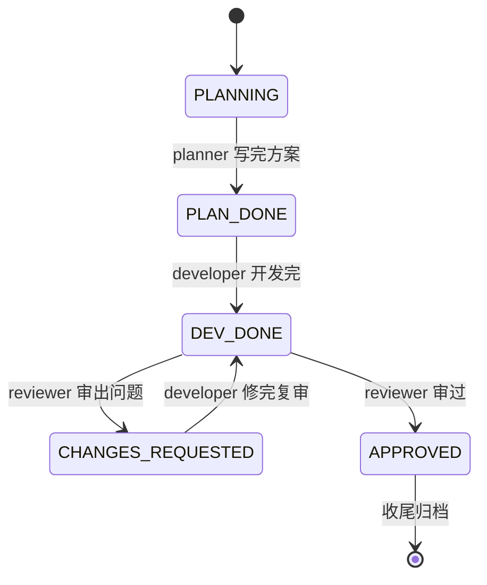

# STATUS 状态机（工具无关）

> 这套流程的"指挥棒"。共享文件总线里 `handoff.md` 顶部有一个 STATUS 块，
> 任何 agent 接手先读它，就知道：现在在哪一格、轮到哪个 role、下一步该干嘛。
> 本目录定义状态机本身；具体每个状态交给哪个 role，由项目根 `team.yaml` 的 `handoff` 段决定。

---

## 示例状态机（plan → dev → review → 归档）

对应示例编制（planner / developer / reviewer 三角色）。这不是框架内建标准；角色不同则状态机不同，以项目根 `team.yaml` 的 `handoff` 段为准。



---

## 状态字段定义

每个状态对应一行 `team.yaml` 的 `handoff` 规则：`state` / `next_role` / `human_gate`，并用 `on_done` 或 `transitions` 声明完成后去哪里。

| 状态 | 含义 | next_role | 完成后 |
| :--- | :--- | :--- | :--- |
| `PLANNING` | 方案撰写中 | planner | `on_done: PLAN_DONE` |
| `PLAN_DONE` | 方案定稿 | developer | `on_done: DEV_DONE` |
| `DEV_DONE` | 开发完待审 | reviewer | `APPROVED` 或 `CHANGES_REQUESTED` |
| `CHANGES_REQUESTED` | 被打回待修 | developer | `on_done: DEV_DONE` |
| `APPROVED` | 审过 | null | 收尾 |

> `human_gate=true` 的每个节点 = **审查点 + commit 点 + 交接点**三合一。这是"人工编排"的落点。

---

## STATUS 块格式（写在 handoff.md 顶部）

```
## STATUS
状态: DEV_DONE
轮到: reviewer (cc)
commit范围: <git 策略；或以下方修改范围圈定>
涉及仓库: <repos 之一或多个>
更新: 2026-06-25 by developer
```

接手方读这五行即可定位：在哪一格、自己是不是被点名、要看哪个仓的 diff、谁什么时候改的。

---

## 自定义状态机

改 `team.yaml` 的 `roles` 和 `handoff` 段即可裁剪：

- **加 tester**：在 `roles` 加 `tester`，在 `handoff` 插入如 `DEV_DONE → tester`（先测）、`TEST_PASSED → reviewer`、`TEST_FAILED → developer`。
- **去掉 planner**（小改动直接开发）：删 `PLANNING / PLAN_DONE` 相关行，让流程从你定义的第一个状态起步，例如 `DEV_READY → developer`。
- **规则**：每个 `next_role` 必须是 `roles` 里声明过、且被某个 agent 认领的 role；每个 `on_done` / `transitions[].state` 必须是 `handoff.state` 里已有的 STATUS。改完重新生成各工具适配文件。
